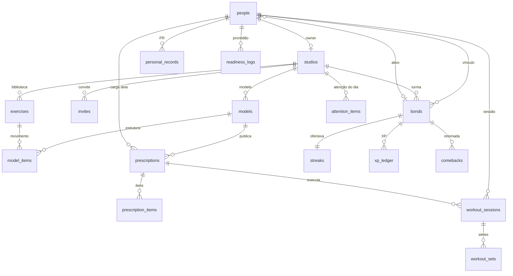

# Schema v1

Postgres is the source of truth. Files live in object storage; this database stores the path. Domain language: [`CONTEXT.md`](../CONTEXT.md).

## O que é tabela e o que é leitura

| Termo | Onde |
| --- | --- |
| Pessoa | `people` |
| Estúdio | `studios` |
| Vínculo | `bonds` + `people.active_bond_id` |
| Convite + código | `invites`, `login_codes`, `auth_sessions` |
| Modelo | `models`, `model_items` |
| Prescrição | `prescriptions`, `prescription_items` |
| Sessão | `workout_sessions`, `workout_sets` |
| PR | `personal_records` (sem `studio_id`) |
| Ofensiva + protetor | `streaks` |
| XP / liga | `xp_ledger`, `badges` |
| Atenção do dia | `attention_items` |
| Prontidão | `readiness_logs` |
| Retomada | `comebacks` |
| Fio | view `fio_days` |
| Mídia | `media_objects`, `progress_photos` |
| Push | `push_devices` |
| Fila | `jobs` (vazia) |
| Aviso ao personal | `session_alerts` |

Invariantes: lote nunca copia `load_kg`; PR e foto são da Pessoa; ofensiva/XP/selos são do Vínculo.
